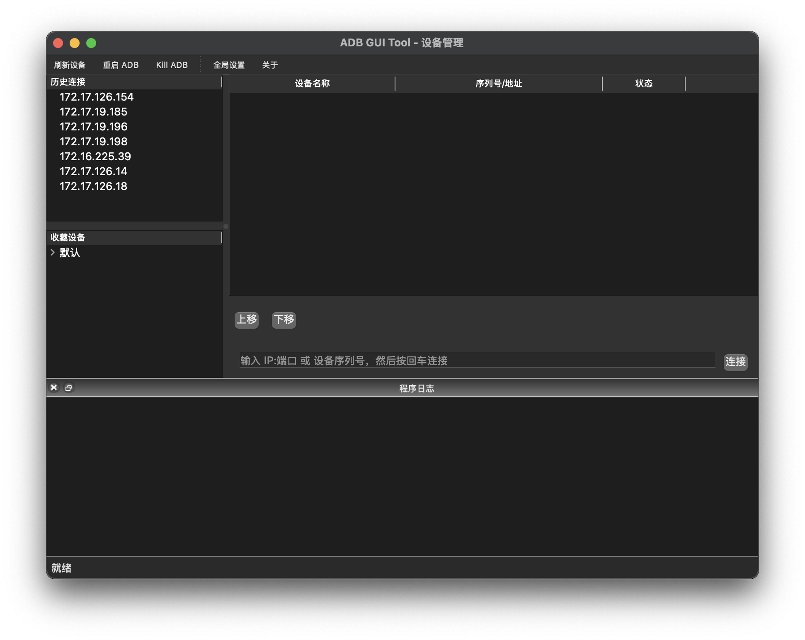
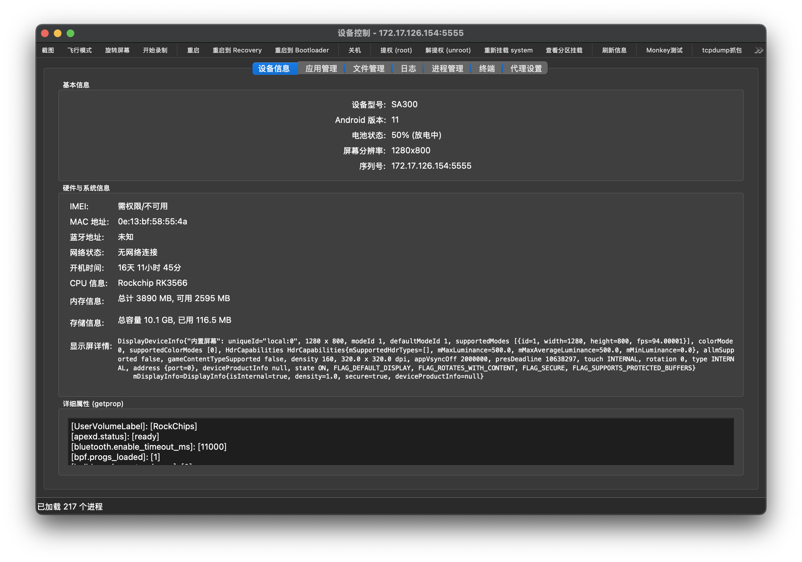
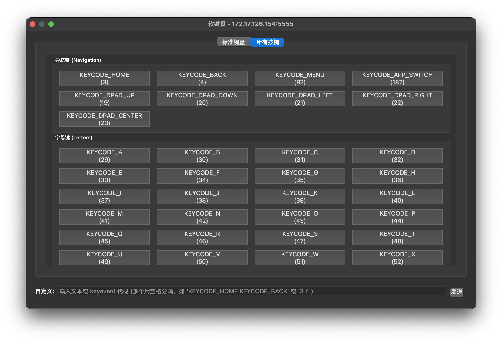

# ADB GUI Tool

A powerful (?) GUI ADB tool written in Python + PyQt5.

> [!NOTE]
> 🌐 Currently only Chinese is available.

## Requirements

- Python 3.7+
- PyQt5
- ADB (Android Debug Bridge)

## Current Support

- **Host OS**: macOS 15 (primary)  
  *Windows and Linux support are planned but not yet fully tested.*
- **Target Android versions tested**: Android 11, Android 7

## Features

- **Device Management**
  - Auto‑detection and manual refresh of connected devices (USB / network)
  - Device aliases, favorites, and connection history
  - Drag‑and‑drop reordering of the device list
- **Device Information**
  - Model, Android version, battery, screen resolution, IMEI, MAC, Bluetooth, uptime, CPU, memory, storage
  - Real‑time property dump (`getprop`)
- **App Management**
  - List system and user apps with icons (asynchronously cached)
  - Search / filter (plain text or regex)
  - Install APKs via drag & drop, uninstall, clear data, export APK
  - Launch apps normally or with root privileges
- **File Manager**
  - Dual‑pane layout (directory tree + file table)
  - Upload, download (with progress), delete, rename, create folder
  - Keyboard quick‑locate, hidden files toggle
- **Logcat Viewer**
  - Real‑time logcat output with level filtering (V/D/I/W/E/F)
  - Search highlight, pause/resume, save to file
- **Process Manager**
  - View running processes, kill selected processes
  - Copy PID or process name, adjustable refresh interval
- **Interactive Shell / Terminal**
  - Full `adb shell` terminal with command history
- **Built‑in Soft Keyboard**
  - Standard key layout + all Android KeyEvent constants grouped by category
- **Broadcast Sender**
  - Send arbitrary `am broadcast` commands with optional extras
- **Proxy Settings**
  - View, set, and clear the device's global HTTP proxy
- **Toolbar Quick Actions**
  - Screenshot, screen recording, reboot (system / recovery / bootloader), shutdown
  - Root / unroot management, remount `/system`, view partition mounts
  - Monkey test, tcpdump packet capture, immersive mode toggles
- **Global Settings**
  - Configurable ADB and scrcpy paths
  - Language selection (Chinese / English) – *please see Known Issues*
  - Customisable keyboard shortcuts for common actions
  - Clear cache, restore default settings

## Screenshots

### Main Window

### Device Control Window

### Soft Keyboard Window

## Known Issues

- **Multi‑language support is not yet functional.**  
  The translation framework (`QTranslator`) and `.qm` files have been prepared, and all UI strings are wrapped with `self.tr()`. However, applying a language change does not currently replace any visible text. This is being investigated.

- **Windows / Linux compatibility not tested.**  
  Path handling, ADB discovery, and shortcut keys may require adjustments for non‑macOS systems.

- **Some features are incomplete or experimental:**
  - File manager back/forward navigation is stubbed.
  - Screen recording may fail if the device doesn’t support `screenrecord` or if the process hangs.
  - IMEI retrieval is not guaranteed on all devices (requires permissions or root).
  - tcpdump capture assumes `tcpdump` is available on the device and root access is granted.

- **Performance on older devices (e.g. Android 7) may be slower** during app list loading due to the icon extraction method.

## AI-Assisted Development

This project is developed with the assistance of large language models (code generation, refactoring, documentation, and translation). All AI‑generated content has been reviewed and adapted by a human.

## License

MIT (see `LICENSE` file)
